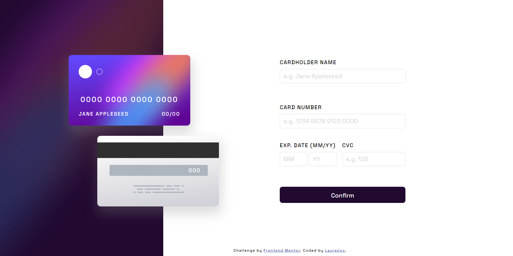

# Frontend Mentor - Interactive card details form solution

This is a solution to the [Interactive card details form challenge on Frontend Mentor](https://www.frontendmentor.io/challenges/interactive-card-details-form-XpS8cKZDWw). Frontend Mentor challenges help you improve your coding skills by building realistic projects. 

## Table of contents

- [Overview](#overview)
  - [The challenge](#the-challenge)
  - [Screenshot](#screenshot)
  - [Links](#links)
- [My process](#my-process)
  - [Built with](#built-with)
  - [What I learned](#What-I-learned)
- [Author](#author)

## Overview

### The challenge

Users should be able to:

- Fill in the form and see the card details update in real-time
- Receive error messages when the form is submitted if:
  - Any input field is empty
  - The card number, expiry date, or CVC fields are in the wrong format
- View the optimal layout depending on their device's screen size
- See hover, active, and focus states for interactive elements on the page

### Screenshot




### Links

- Solution URL: [https://www.frontendmentor.io/solutions/interactive-card-details-form-using-flexbox-SAjdapXE8U](https://your-solution-url.com)
- Live Site URL: [https://awsmpuff.github.io/interactive-card-details-form/](https://your-live-site-url.com)

## My process

### Built with

- Semantic HTML5 markup
- Flexbox

### What I learned

```css
/* Make a rounded linear gradient border */
input {
    outline: none;
    border: 1.6px solid transparent;
    border-radius: 10px;
    background-image: linear-gradient(white, white), linear-gradient(to right, hsl(249, 99%, 64%), hsl(278, 94%, 30%));
    background-origin: border-box;
    background-clip: padding-box, border-box;
}
```

## Author

- Website - [Wanxia Xie/Laurenxx](https://www.your-site.com)
- Frontend Mentor - [@awsmPuff](https://www.frontendmentor.io/profile/awsmPuff)

